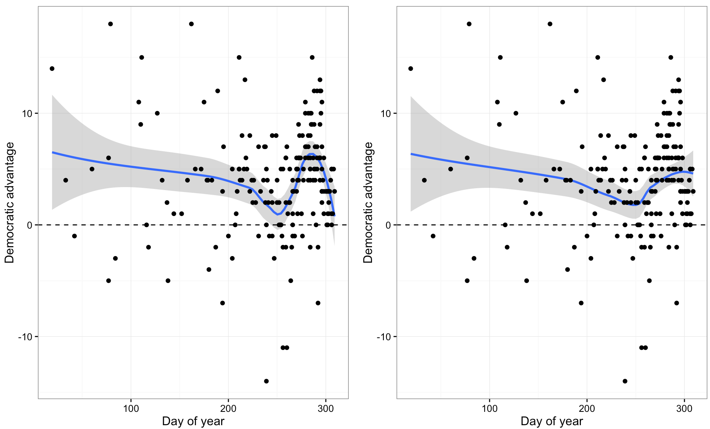

Prior to the election, I ([`@statwonk`](http://twitter.com/statwonk)) read a very interesting analysis by George Berry, a PhD student at Cornell, that attempted to explain the reason Nate Silver's 538 poll gave Donald Trump a 1/3 chance in winning (much higher than other major polls). You should start by reading [that analysis before continuing](https://medium.com/@georgeberry_8550/overview-4fa5fa157fd1#.j5kxnyar2).

Below are two graphs from that analysis. They both use the local weighted scatterplot smoothing (loess) method. Berry was comparing two different paramters 0.65 and 0.85 that determine the width of the regression window. Visually the 0.65 appears to me to be the better fit, but there are statistical methods to precisely optmize the parameter.



<br>
Being a data scientist / statistician, I thought the apparent hook in polls was really interesting. The polls swung hard in Hillary Clinton's favor prior to the election. **October 24th, 2016** was the date Clinton told NBC's Today show, "[I don't think about responding to Donald Trump anymore.](http://www.today.com/video/hillary-clinton-i-don-t-think-about-responding-to-donald-trump-anymore-792136259661)"

There are many ways to fit a model to data. I'm reminded of statistician George Box's, "[All models are wrong but some are useful](https://en.wikipedia.org/wiki/All_models_are_wrong)." To answer the question of how polls shifted prior to the election and whether F.B.I. Director James Comey's letter to Congress on **October 28th, 2016** had an influence in the election, I propose this: **if you're a statistician or scientist, join me by forking this repository and creating your own analysis**.

[Then submit a pull request back to this repository](https://github.com/statwonk/comey) and we can critique, refine, debate, improve and ultimately generate the necessary credibility to reduce uncertainty about this important question.

Maybe the letter didn't effect the election, maybe it did? ¯\\_(ツ)_/¯ Let's see if we can reduce uncertainy around the answer to that question.

# The Data

This is George Berry's original repository: [https://github.com/georgeberry/simple_polls](https://github.com/georgeberry/simple_polls). I'm going to start work by pulling the data and putting it under version control. It would be helpful if others would pull the data so we can begin to organize and critique the data.

Berry uses the results of many polls hosted by The Huffington Post. It'll be important to bring together as many other data sources as possible to cross-check, critique, test and ensure we're working with the highest quality data.

```
'http://elections.huffingtonpost.com/'
                   'pollster/api/polls.json?'
                   'state={}&'
                   'page={}&'
                   'topic={}'
```

```{r, message=FALSE}
install.packages("tidyverse"); install.packages("jsonlite")
library(tidyverse); library(jsonlite)
# fromJSON()
```

# Analysis

_work in progress_.
